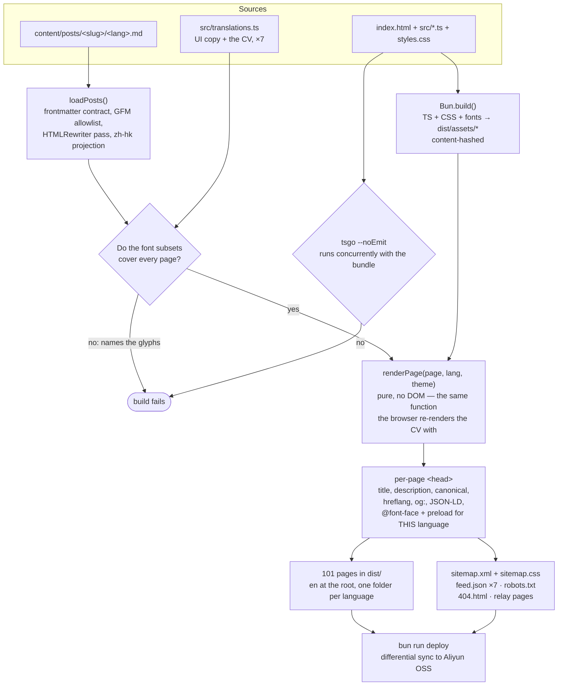

# Philippe Ribeiro—writing, and a CV

A seven-language personal site—EN / FR / PT / ES / 简体 / 繁體, plus a Hong Kong
reading of the Traditional pages that is served by browser language rather than
offered as a seventh button—pre-rendered to static HTML and progressively
enhanced with pretext-driven typography. No framework.

Articles are Markdown on disk; the CV is one page among them. An article exists
in one or more languages, and each language’s index lists only what exists in
it—no dead links, no ghost translations.

The regional variants are deliberate: Portuguese is European and follows the
pre-1990 orthography, Spanish is peninsular, Traditional Chinese follows Taiwan
usage, and `zh-hk` carries Hong Kong / Macau vocabulary in Noto Sans HK.

## How a build works

One command, `bun run build`, and everything below happens in it. The two
diamonds are gates: they stop the build rather than ship something wrong.



Everything in `dist/` uses **relative** asset paths, so the same output serves
from a bucket root, a sub-path, or GitHub Pages without a rebuild. Only the SEO
URLs are absolute, and only when `SITE_URL` is set.

## Stack

- **[Bun](https://bun.com)**—package manager, dev server and bundler (no
  Vite/Webpack).
- **TypeScript** (vanilla, no UI framework). The UI is plain string templates in
  the `src/render*` modules, rendered into `#app`—
  [src/render.ts](src/render.ts) is a facade over the shared chrome, the CV
  chapters and the blog pages.
- **[@chenglou/pretext](https://github.com/chenglou/pretext)**—text
  measurement/layout (canvas, no DOM reflow), driving the measurement features
  below.
- **[hyphen](https://www.npmjs.com/package/hyphen)**—Liang syllable hyphenation
  patterns.

## Features

- **SSG pre-render**—[scripts/build.ts](scripts/build.ts) emits a home, a CV and
  a writing index for each of the seven languages, plus one page per article,
  with the content already in the HTML (SEO, link previews, works with JS off).
  English sits at the site root, every other language in its own folder; asset
  paths are computed from each page’s depth and stay relative, so `dist/`
  deploys to any base path unchanged.
- **A Hong Kong / Macau reading** of the Traditional pages, in local vocabulary
  (軟件, 項目, 網絡…) and Noto Sans HK’s character forms. It is a five-term
  projection of the Taiwan page, not a seventh translation to maintain, and it
  has no button in the switcher: browsers asking for `zh-HK` or `zh-MO` are sent
  there, and `hreflang="zh-HK"` points search engines at it.
- **Measurement-driven layout** ([src/measure.ts](src/measure.ts))—pretext fits
  the hero name to the viewport width, sizes the section titles to their column
  (uniform, no ellipsis truncation), and tightens the nav shortcuts into the
  fixed width the bar leaves them, across all seven languages. Dev-only console
  audits flag any title or nav label that would overflow.
- **Knuth–Plass justification** ([src/linebreak.ts](src/linebreak.ts))—the About
  paragraphs and every article paragraph are re-typeset with TeX-style optimal
  line breaking and syllable hyphenation, over pretext-measured boxes and glue
  (Latin languages; Chinese wraps natively). The paragraph arrives as styled
  runs, each measured in its own font, and each line is rebuilt by cloning the
  paragraph’s own elements ([src/richtext.ts](src/richtext.ts)) — so a link
  keeps its `rel`, a Chinese run keeps its `lang`, and nothing is re-serialized.
  An `IntersectionObserver` typesets each paragraph just before it reaches the
  reader (measured layout shift: 0), and copying a passage gives back the prose,
  not the column. The hyphenation patterns load per language, on demand.
- **Self-hosted fonts, sized to what a page really draws**—Noto Sans plus Noto
  Sans SC/TC/HK, subset to the glyphs actually used. Each page declares only the
  family its own stack names, and the Latin languages do not name a Chinese
  family at all: the twenty Chinese characters they render (the switcher’s
  endonyms, 微辣 in the dialogue, whatever an article quotes) live in an 8 KB
  subset of their own. Naming Noto Sans SC there cost an English reader 342 KB
  of font, measured; the English home page now loads 47 KB in total. The CV,
  which changes language without navigating, is given the new family at the
  moment of the switch. No web-font CDN, no runtime network dependency.
- **Language negotiation**—a visitor landing on the site root is sent to the
  page in their browser’s language (English when none matches); a language they
  pick by hand is remembered and outranks the browser from then on. URLs that
  name a language (`/fr/`) are never redirected, so shared links keep their
  language. The pre-blog URLs (`fr.html`) still answer, through `noindex` relay
  pages — object storage cannot return a 301 without a rule on the CDN, and a
  relay depends on no host configuration at all.
- **The language switch reloads, except on the CV.** Its seven translations all
  ship in the bundle, so it re-renders in place; the home, the index and the
  articles are built from content that lives on disk and is deliberately not
  bundled, so there the switcher is an ordinary link.
- **Light / dark theme**, reveal-on-scroll, animated stats.

## Commands

Bun ≥ 1.3.14 is the only requirement to build, test and serve the site.
[Deno](https://deno.com) is a second, **optional** prerequisite: it is the
project’s formatter and linter (`deno fmt` then `deno lint`, run from the root
at the end of a change—there is no config, the defaults are the contract), and
`bun run fonts:update` shells out to `deno fmt` to normalize the file it
generates. That call is `.nothrow()`, so without Deno the regeneration still
succeeds and merely shows up as formatting churn in the diff.

```bash
bun install            # install dependencies
bun run dev            # dev server with HMR → http://localhost:3000/
bun run build          # type-check + pre-render the whole site into dist/
bun run preview        # build, then serve dist/ at its real URLs → http://localhost:4173
bun run check          # tsgo --noEmit (TypeScript 7 native compiler, the type gate)
bun test               # full suite: line breaking, render, translations, font coverage, build
bun run fonts:update   # regenerate the Noto subsets (CI does this for you)
bun run deploy         # differential sync of dist/ to Aliyun OSS (--dry-run, --smoke)
```

## Deploy

`bun run build` produces a self-contained `dist/` with **relative asset paths**,
so it uploads to any static host or cloud-storage bucket—at any path—with no
configuration (and works on GitHub Pages too). Set
`SITE_URL=https://example.com` before building to emit absolute canonical /
`hreflang` URLs, a sitemap, and the `og:image` / Twitter-card tags for social
link previews (search engines and social scrapers require absolute URLs there).
The preview image itself is [public/og-image.png](public/og-image.png), copied
to the site root at build time. To see what a scraper would show for a built
page, read the tags back out of it:

```bash
bun scripts/social-meta.ts dist/index.html dist/fr/cv.html
```

`dist/sitemap.xml` follows the
[sitemaps.org 0.9 protocol](https://www.sitemaps.org/protocol.html): one `<url>`
for every page written—home, CV and writing index per language, plus one per
article—at the URL that page declares canonical. The fixed pages carry a
`<lastmod>` read from the last commit that touched the rendered content; an
article carries the date of its own source file, so editing one post does not
re-date the rest. Neither is ever the build date, and an absent date is the
honest answer when git cannot give one. `<changefreq>` and `<priority>` are
deliberately absent (see the header of
[scripts/sitemap.ts](scripts/sitemap.ts)). Read it back the way a crawler would:

```bash
bun scripts/sitemap.ts dist/sitemap.xml
```

Opening that URL in a browser shows a styled list rather than a bare tag tree,
through the `<?xml-stylesheet?>` instruction pointing at `dist/sitemap.css`
(generated by [scripts/sitemap-style.ts](scripts/sitemap-style.ts), and
invisible to crawlers and to `parseSitemap`). It shows less than a table
would—CSS cannot turn `<loc>` into a link, and no selector reads element text,
so there is no language column. An XSLT stylesheet used to draw that table; it
was removed rather than kept to its end date, since Chrome drops XSLT in 158 and
it had already fallen out of step with the site’s layout.

Each page also links a [JSON Feed 1.1](https://www.jsonfeed.org/version/1.1/)
(`dist/feed.json` for English, `dist/feed.<lang>.json` otherwise). Its items are
that language’s articles, with `date_published` taken from the frontmatter—the
author’s own date, explicit, and nothing a shallow clone can empty. Which fields
are emitted, and why the optional ones it leaves out are left out, is documented
at the top of [scripts/feed.ts](scripts/feed.ts).

### The workflows

Four, and each does one thing.

| Workflow            | When                          | What                                                                          |
| ------------------- | ----------------------------- | ----------------------------------------------------------------------------- |
| `ci.yaml`           | every pull request            | type-check, test, build, `deno fmt`/`lint`                                    |
| `deploy.yaml`       | push to `main`                | build with the Pages `SITE_URL`, publish to GitHub Pages                      |
| `deploy-oss.yaml`   | push to `main`                | build, then differential sync to Aliyun OSS — inert until `OSS_BUCKET` exists |
| `update-fonts.yaml` | push touching content or copy | re-subset the Noto files, commit them, dispatch the deploys                   |

All four check out with `fetch-depth: 0`, because `<lastmod>` is read from git
history and a shallow clone would silently drop it.

### Aliyun OSS

[scripts/deploy.ts](scripts/deploy.ts) uploads `dist/` with **no dependency
added**, which three measured facts make possible: Aliyun’s `AssumeRoleWithOIDC`
is anonymous, so trading a GitHub OIDC token for temporary credentials needs no
signature; OSS speaks SigV4, which `Bun.S3Client` signs; and a presigned PUT
signs `host` and nothing else, so `Cache-Control` and `Content-Type` ride along
as ordinary headers. No access key is stored anywhere — `id-token: write` is the
whole secret management.

The sync is differential in both directions. Hashed assets are settled by their
key, since the same key means the same bytes; everything else is compared
against the ETag OSS returns, which is the object’s MD5. A second deploy of an
unchanged site writes nothing. What the build no longer emits is removed — and
removing more objects than the site contains stops the run, because that means
the wrong bucket or the wrong prefix rather than a tidy-up.

```bash
bun run deploy --dry-run   # print the plan, no credentials needed
bun run deploy --smoke     # one object there and back: does this bucket accept us?
bun run deploy --prune     # yes, I read the deletion list
```

Locally it reads the Aliyun CLI’s own `~/.aliyun/config.json`, so the secret
stays where it already lives. In Actions it never sees one.

## Editing content

Copy lives in two places, and the split is deliberate.

Interface strings and the CV are in [src/translations.ts](src/translations.ts),
typed so the seven languages stay in structural sync — a missing key is a
compile error, not a blank on the page.

Articles are Markdown on disk, at `content/posts/<slug>/<lang>.md`: the folder
name is the slug, the file name is the language. An article exists in one or
more languages, and a language’s index lists only what exists in it — the file
system carries the fact, so there is no table to keep in step. Writing
`zh-hant.md` is enough for Hong Kong: the lexical projection derives it, and an
explicit `zh-hk.md` wins if you want to write one.

After editing anything visible, run `bun run preview` — the build refuses to
emit a site whose font subsets do not cover the text, and names the glyphs it is
missing.

See [AGENTS.md](AGENTS.md) for the code conventions.

## License

© 2026 Philippe Ribeiro. All rights reserved.
